### Hi there 👋, I'm [BOUALI](https://github.com/youssefbouali) !!

7 Years of software development experience.

<!--
**youssefbouali/youssefbouali** is a ✨ _special_ ✨ repository because its `README.md` (this file) appears on your GitHub profile.

Here are some ideas to get you started:

-->

- 🎓 I'm Studying Computer Science
- 🔭 I’m currently working as a Full Stack Developer
- 🌱 I’m currently learning Java
- 💼 Personal Portfolio bouali.wsoum.eu.org
<!-- - 👯 I’m looking to collaborate on ...
- 🤔 I’m looking for help with ...
- 💬 Ask me about ...
- 📫 How to reach me: ...
- ⚡ Fun fact: ...
- ⚡ I am interested in Philosophy of History, Physics and Technology -->

 

**Contact me :** 
 

  

**Languages and Technologies:**
 

<a href="https://en.wikipedia.org/wiki/Progressive_web_application">
  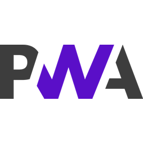
</a>

<a href="https://git-scm.com/">
  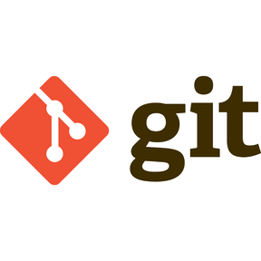
</a>

<!--a href="https://www.phpmyadmin.net/">
  
</a-->

 

<!--a href="https://subgraph.com/vega/">
  
</a-->

        

**I’m currently learning:**
 

<a href="https://www.ruby-lang.org/en/">
  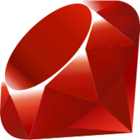
</a>

<!--a href="https://en.wikipedia.org/wiki/Pascal_(programming_language)">
  
</a-->
<!--a href="https://www.rust-lang.org/">
  
</a-->
<!--a href="https://www.lua.org/">
  
</a-->
<!--a href="https://www.scala-lang.org/">
  
</a-->
<!--a href="https://en.wikipedia.org/wiki/C_Sharp_(programming_language)">
  
</a-->
<!--a href="https://www.asp.net/">
  
</a-->

<!--a href="https://spring.io/">
  
</a-->

<a href="https://www.chartjs.org/">
  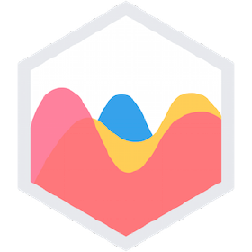
</a>

<a href="https://angular.io/">
  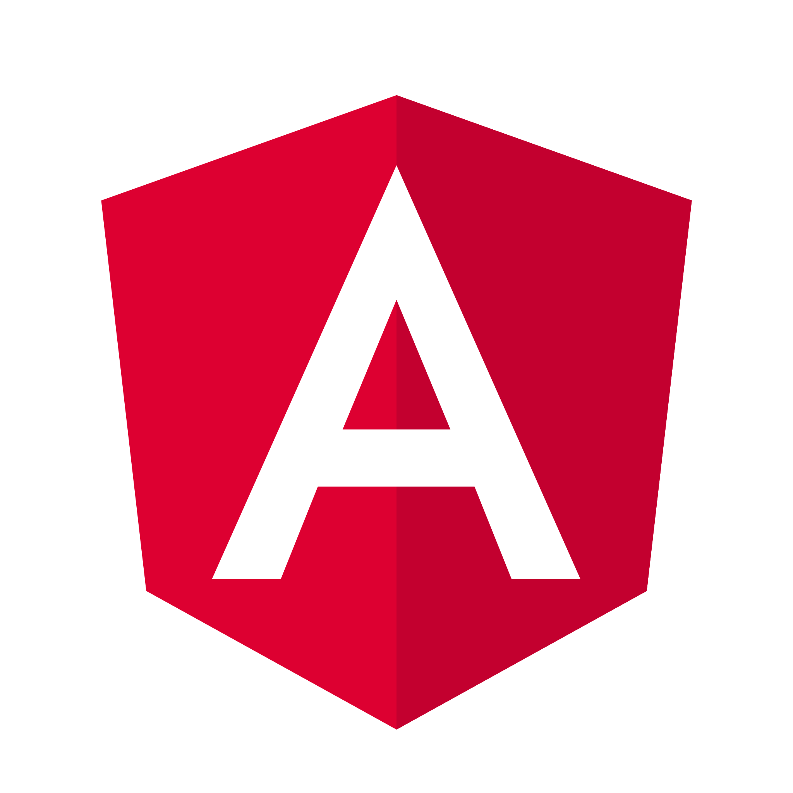
</a>

<a href="https://ionicframework.com/">
  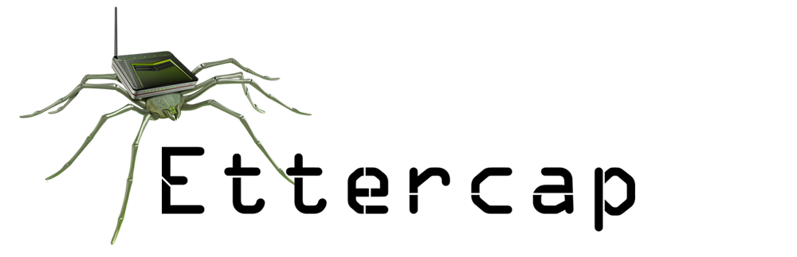
</a>

<!--a href="https://dart.dev/">
  
</a>

<!--a href="https://fr.wikipedia.org/wiki/Xamarin">
  
</a-->

<!--a href="https://go.dev/">
  
</a-->

<a href="https://fr.wikipedia.org/wiki/Hyper-V">
  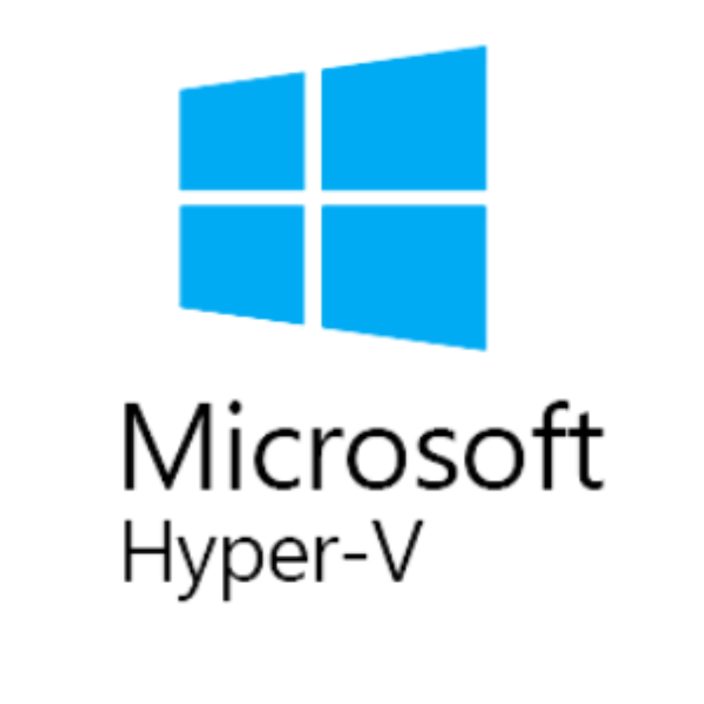
</a>
  
<a href="https://azure.microsoft.com/">
  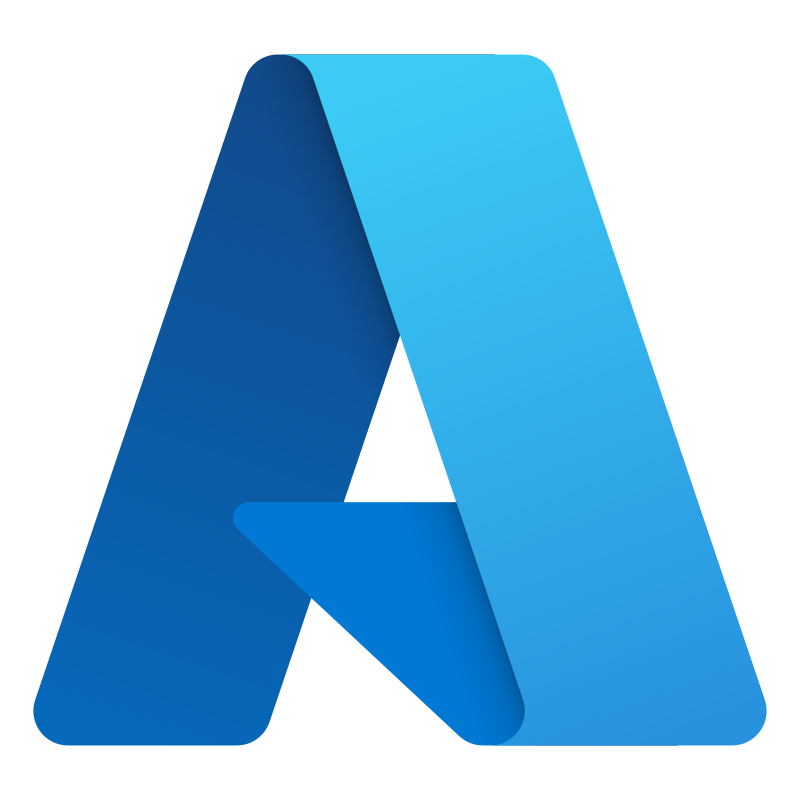
</a>

  

<!--a href="https://www.splunk.com/">
  
</a-->

<!--a href="https://www.openwall.com/john/">
  
</a>
<a href="https://www.maltego.com/">
  
</a-->

<a href="https://sqlmap.org/">
  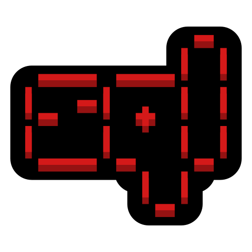
</a>

<a href="https://en.wikipedia.org/wiki/X86_assembly_language">
  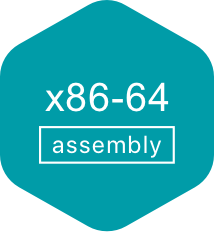
</a>

<a href="https://www.arduino.cc/">
  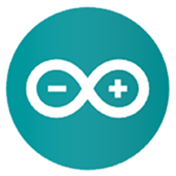
</a>
<a href="https://www.raspberrypi.org/">
  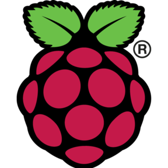
</a>

 

<a href="https://sphinxsearch.com/">
  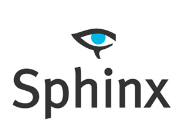
</a>

<a href="https://opencv.org/">
  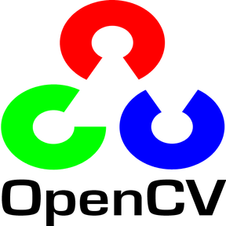
</a>

 
 

##
<a href="https://bouali.wsoum.eu.org" target="_blank">
💬 Find me [elsewhere on the internet]().</a>
