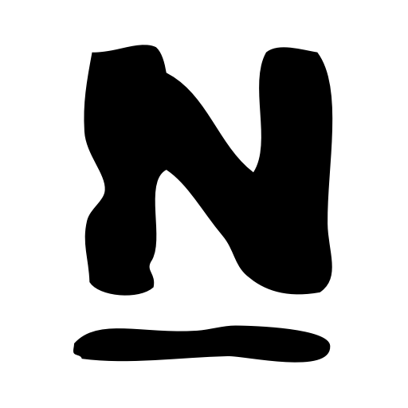
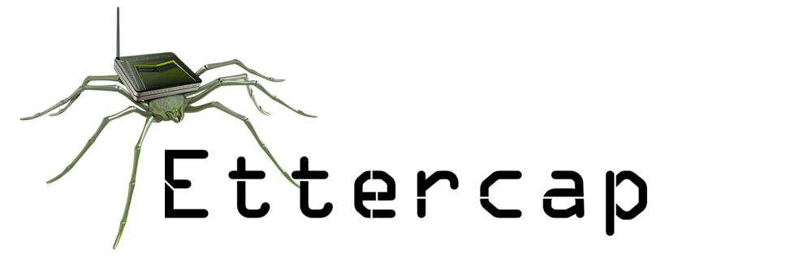

### Hi there 👋, I'm [BOUALI](https://github.com/youssefbouali) !!

7 Years of software development experience.

<!--
**youssefbouali/youssefbouali** is a ✨ _special_ ✨ repository because its `README.md` (this file) appears on your GitHub profile.

Here are some ideas to get you started:

-->

- 🎓 I'm Studying Computer Science
- 🔭 I’m currently working as a Full Stack Developer
- 🌱 I’m currently learning Java
<!-- - 💼 Personal Portfolio bouali.wsoum.eu.org ->
<!-- - 👯 I’m looking to collaborate on ...
- 🤔 I’m looking for help with ...
- 💬 Ask me about ...
- 📫 How to reach me: ...
- ⚡ Fun fact: ...
- ⚡ I am interested in Philosophy of History, Physics and Technology -->
 

**Contact me :** 
 

<!--a href="https://www.linkedin.com/in/youssef1bouali">

</a>
<a href="https://twitter.com/youssef1bouali">

</a-->
  

**Languages and Technologies:**
 

<!--a href="https://www.phpmyadmin.net/">
  
</a-->

  

  

<a href="https://www.djangoproject.com/">

</img></a>
<a href="https://flask.palletsprojects.com/">

</img></a>

  
 

<!--a href="https://subgraph.com/vega/">
  
</a-->

        

**I’m currently learning:**
 

<!--a href="https://en.wikipedia.org/wiki/C_(programming_language)">

</a>

<a href="https://rubyonrails.org/">

</img></a>

<a href="https://www.raspberrypi.org/">

</a-->

<!--a href="https://www.splunk.com/">

</a-->
<!--a href="https://www.openwall.com/john/">
  
</a>
<a href="https://www.maltego.com/">
  
</a-->

<!--br/>

<a href="https://wiki.python.org/moin/PyQt">

</img></a>
<a href="https://openjfx.io/">

</img></a>

<a href="https://www.adobe.com/products/premiere.html">

</a-->

<!--a href="https://spring.io/">
  
</a-->
<!--a href="https://en.wikipedia.org/wiki/Pascal_(programming_language)">
  
</a>

<a href="https://www.asp.net/">
  
</a-->
<!--a href="https://dart.dev/">
  
</a>

<!--a href="https://en.wikipedia.org/wiki/Xamarin">
  
</a-->
<!--a href="https://go.dev/">
  
</a-->

 
 

<!--img align="center" src="https://github-readme-streak-stats.herokuapp.com/?user=youssefbouali&theme=transparent" alt="Youssef-Bouali"-->

##
<!--a href="https://bouali.wsoum.eu.org" target="_blank">
💬 Find me [elsewhere on the internet]().</a-->
